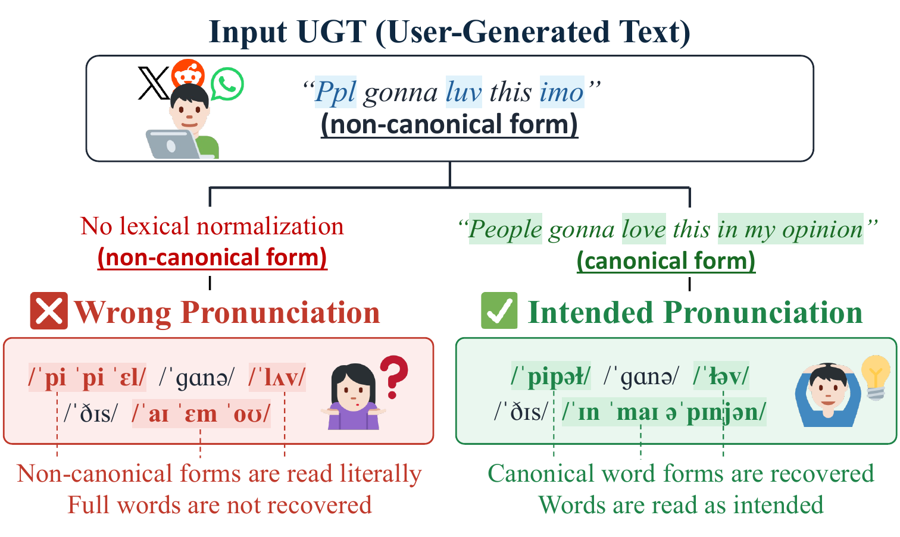

# UGTPHON

**Phonemes for the messy language of the internet: a multilingual G2P benchmark for user-generated text.**


<p align="center">
  <b>📝 <a href="#citation">Paper (BibTeX)</a></b> &nbsp;|&nbsp; <b>⚡ <a href="#loading">Loading</a></b> &nbsp;|&nbsp; <b>💻 <a href="#data-format">Data &amp; Format</a></b> &nbsp;|&nbsp; <b>🔤 <a href="#phoneme-annotation">Phoneme Annotation</a></b>
</p>

<p align="center">
  <b>MinJu Jeon</b><sup>1,2</sup>*, <b>Younghan Park</b><sup>3</sup>, <b>Han Sung Park</b><sup>4</sup>, <b>Jong-Hwan Kim</b><sup>1</sup>, <b>Dong-Jin Kim</b><sup>2</sup><sup>†</sup>, <b>Hoyeon Lee</b><sup>1</sup><sup>†</sup><br>
  <sub><sup>1</sup>NAVER Cloud, <sup>2</sup>Hanyang University, <sup>3</sup>Carnegie Mellon University, <sup>4</sup>Georgia Institute of Technology</sub><br>
  <sub>* Work performed during an internship at NAVER Cloud. <sup>†</sup> Corresponding authors.</sub><br>
  <sub><b>Findings of the Association for Computational Linguistics: EMNLP 2026</b></sub>
</p>

<p align="center">
  
</p>

<p align="center">
  <sub>Conventional G2P models (red, left) read non-canonical words literally, turning <i>ppl</i> and <i>imo</i> into letter names.<br>
  Accurate phonemization (green, right) requires recovering the canonical form (<i>people</i>, <i>love</i>, <i>in my opinion</i>) before generating phonemes.</sub>
</p>

## Introduction

**UGTPHON** gives IPA phoneme transcriptions to *user-generated text*, the noisy and non-canonical language of social media, across **English, Vietnamese, and Korean**. It covers **18,373 sentences** (5,029 en / 10,847 vi / 2,497 ko).

Standard G2P resources are built on clean dictionary words. UGTPHON instead pairs each noisy sentence with three aligned layers: (1) a gold canonical normalization, (2) the sentence-level IPA of that canonical form, and (3) per-token annotations that align raw surface, normalization, and phonemes, labelling every non-canonical token with a **9-way A/B/C taxonomy**. Because the layers are aligned, the same data supports G2P on noisy text, lexical normalization (sentence- or token-level), non-canonical detection and classification, and the interaction between normalization and phonemization (normalize-then-phonemize vs. direct G2P).

A row-aligned `moderation/` sidecar ships per-sentence safety scores so the core data stays clean. The scores are **advisory metadata, not gold labels**. See [Ethical Considerations](#ethical-considerations).

## Repository structure

```text
UGTPHON/
├── en/                          # lang ∈ {en, vi, ko}
│   ├── train.json
│   ├── dev.json
│   ├── test.json
│   └── LICENSE                  # per-language license (see License)
├── vi/  ...
├── ko/  ...
├── moderation/                  # row-aligned safety-score sidecar
│   ├── en/{train,dev,test}.json
│   ├── vi/...  ko/...
│   └── README.md
├── assets/
└── README.md
```

## Loading

UGTPHON is plain JSON, so no special library is required.

```python
import json

def load(lang, split):
    with open(f"{lang}/{split}.json", encoding="utf-8") as f:
        return json.load(f)

data = load("en", "test")
print(len(data), data[0]["phonemes"])

# Optional: attach the row-aligned moderation sidecar.
# Join per split. Ids are unique only within a (lang, split) file.
with open("moderation/en/test.json", encoding="utf-8") as g:
    mod = json.load(g)
by_id = {m["id"]: m["moderation"] for m in mod}
for r in data:
    r["moderation"] = by_id[r["id"]]
```

## Data Format

Each `{lang}/{split}.json` is a JSON **array** of sample objects, one per sentence. The schema is identical across all three languages.

```json
{
  "id": "lexnorm2015_471851969032634369",
  "lang": "en",
  "source": "lexnorm2015",
  "split": "test",
  "text": "Lebron shoulda just took that smh",
  "canonical": "lebron should have just took that shaking my head",
  "phonemes": "ˈɫɛbɹən ˈʃʊd ˈhæv dʒɪst ˈtʊk ˈðæt ˈʃeɪkɪŋ ˈmaɪ ˈhɛd",
  "tokens": [
    {"text": "Lebron",  "canonical": "lebron",          "phoneme": "ˈɫɛbɹən",           "is_nc": false, "nc_type": null},
    {"text": "shoulda", "canonical": "should have",     "phoneme": "ˈʃʊd ˈhæv",         "is_nc": true,  "nc_type": "C2"},
    {"text": "just",    "canonical": "just",            "phoneme": "dʒɪst,ˈdʒəst",      "is_nc": false, "nc_type": null},
    {"text": "took",    "canonical": "took",            "phoneme": "ˈtʊk",              "is_nc": false, "nc_type": null},
    {"text": "that",    "canonical": "that",            "phoneme": "ˈðæt,ðət",          "is_nc": false, "nc_type": null},
    {"text": "smh",     "canonical": "shaking my head", "phoneme": "ˈʃeɪkɪŋ ˈmaɪ ˈhɛd", "is_nc": true,  "nc_type": "A3"}
  ]
}
```

**Sample-level fields**

- **`id`**: `{source}_{external_id_or_index}`. Unique *within a `(lang, split)` file only*. Vietnamese ids are **not** globally unique across splits (e.g. `vilexnorm_1` appears in train, dev, and test as different sentences), so always join per split and never deduplicate merged splits by `id`.
- **`lang`**: `en` / `vi` / `ko`.
- **`source`**: the origin corpus (see [Sources](#sources)).
- **`split`**: `train` / `dev` / `test`.
- **`text`**: the raw sentence exactly as written (noisy / user-generated).
- **`canonical`**: the gold normalized sentence.
- **`phonemes`**: IPA of `canonical`, whitespace-separated. Punctuation and URLs are dropped and numbers are verbalized. Mentions, emoticons, and stray punctuation that cannot be phonemized may remain as angle-bracketed placeholders (e.g. `<:))>`, `<,>`), mostly in Vietnamese (16.9% of vi sentences; 4 en sentences; none in ko). This field is *derived* from the token phonemes but is **not always** their literal space-join: it usually picks a single variant where a token has comma-joined alternatives, though 139 English sentences do carry the alternatives through (in Vietnamese and Korean the sentence-level field never does; vi commas appear only inside placeholders).
- **`tokens`**: a list of per-token objects, in surface order. Each token carries:
  - **`text`**: the token's raw surface form. Joining these with spaces reconstructs the sentence `text`, but a single token may span **multiple** whitespace-delimited words (phrasal spans, mostly Vietnamese). Do not assume `len(tokens) == len(text.split())`.
  - **`canonical`**: the token's gold normalization. Multiple acceptable forms are joined by `,`.
  - **`phoneme`**: IPA for the canonical form. Empty for mentions, punctuation, and unphonemizable tokens. Multiple acceptable pronunciations are joined by `,`.
  - **`is_nc`**: whether the token is non-canonical (requires normalization).
  - **`nc_type`**: the [taxonomy](#taxonomy) category when `is_nc=true`, else `null`.

**Tone** is encoded inline with IPA tone letters for Vietnamese (e.g. `˧˧`, `˨ˀ˩`). Korean and English carry no tone marks.

> [!WARNING]
> **A comma is not always a separator.** A comma inside `canonical` may be *literal punctuation* carried over from the surface token rather than a variant separator, and which reading dominates is language-dependent. Of the tokens whose `canonical` contains a comma, punctuation accounts for **1,039/1,044** in `en` and **2,943/3,109** in `vi` (e.g. `rồi,`, `vậy,`), whereas genuine variant lists account for **687/732** in `ko` (e.g. `크크,키키,킥킥`). Do not split on `,` unconditionally. A safe rule is to split on `,`, strip leading and trailing punctuation from each part, then drop parts that become empty. What remains is the set of accepted forms, which is a single element in the punctuation case. The rare exception is numeric commas, which should be kept whole: digit grouping in en (5 tokens such as `2,000`) and decimal commas in vi (e.g. `1,25`, `0,5`).

> [!NOTE]
> **Vietnamese text is not uniformly NFC-normalized.** 33 of the 10,847 Vietnamese sentences carry NFD (decomposed) sequences in `text` and/or `canonical`, so two visually identical forms can differ byte for byte. Apply `unicodedata.normalize("NFC", s)` before any exact string matching, deduplication, or vocabulary counting on those fields. The `phoneme` fields are unaffected in practice, with a single decomposed token in the training split.

<details>
<summary>Vietnamese and Korean examples (tone letters / Hangul)</summary>

```jsonc
// vi/test — vilexnorm_1 (abridged: only the NC tokens are shown)
{
  "text": "Tay này gọt đc k",
  "canonical": "Tay này gọt được không",
  "phonemes": "tăj˧˧ năj˧˨ ɣɔt˨ˀ˩ dɯək̚˨ˀ˩ xoŋ͡m˧˧",
  "tokens": [
    {"text": "đc", "canonical": "được",  "phoneme": "dɯək̚˨ˀ˩", "is_nc": true, "nc_type": "A1"},
    {"text": "k",  "canonical": "không", "phoneme": "xoŋ͡m˧˧",  "is_nc": true, "nc_type": "A2"}
  ]
}
```
```jsonc
// ko/test — multilexnorm2026_1924 (abridged: only the NC token is shown)
{
  "text": "이게 더 나은거 같은데 ㅋㅋ",
  "canonical": "이게 더 나은거 같은데 크크",
  "phonemes": "iɡe̞ tʌ̹ na̠ɯnɡʌ̹ ka̠tʰɯnde̞ kxɯkxɯ",
  "tokens": [
    {"text": "ㅋㅋ", "canonical": "크크,키키,킥킥", "phoneme": "kxɯkxɯ,kçikçi,kçik̚kçik̚", "is_nc": true, "nc_type": "A1"}
  ]
}
```
</details>

### Moderation sidecar (advisory)

`moderation/{lang}/{split}.json` is a JSON array, aligned **row-for-row by `id`** to the matching dataset file. Join per split, and mind the `id` caveat above.

```jsonc
// moderation/en/test — same row as the sample above
{
  "id": "lexnorm2015_471851969032634369",
  "moderation": {
    "raw":  { "flagged": false, "top_category": "harassment", "top_score": 0.0556 },
    "norm": { "flagged": false, "top_category": "harassment", "top_score": 0.0088 }
  }
}
```

- **`raw`** and **`norm`**: moderation of the raw `text` and of the `canonical` text respectively.
- **`flagged`**: the API boolean, true when any category is over threshold.
- **`top_category`** and **`top_score`**: the argmax over the 13 canonical moderation categories and its score, rounded to 4 dp.
- **Model**: OpenAI `omni-moderation-2024-09-26`, a pinned dated snapshot rather than the `*-latest` alias, for reproducibility. Only sentence text is scored. No token-level annotations are sent.

## Statistics

**Splits**

| Lang    | train  |   dev |  test | Total  |
|---------|-------:|------:|------:|-------:|
| **en**  |  3,329 |   600 | 1,100 |  5,029 |
| **vi**  |  8,597 | 1,129 | 1,121 | 10,847 |
| **ko**  |  1,976 |   246 |   275 |  2,497 |
| **All** | 13,902 | 1,975 | 2,496 | 18,373 |

### Taxonomy

Every non-canonical token (`is_nc=true`) gets one of nine categories in three groups. The group says how the token relates to its canonical or phonemic form. Category names and definitions are identical to the taxonomy tables in the paper.

| Group | ID | Category | Description | Examples |
|-------|----|----------|-------------|----------|
| **A: Reconstruct** | A1 | Shortening-V (Vowel Drop) | Canonical-form consonants are preserved, vowels are dropped. | `pls → please`, `đc → được` |
|                    | A2 | Shortening-O (Other Drop) | One or more characters dropped from a single canonical word, beyond vowel-only deletion. | `bc → because`, `k → không` |
|                    | A3 | Phrasal (Unpronounceable) | A multi-word canonical expansion whose pronunciation is not directly recoverable from the surface form. | `smh → shaking my head`, `mn → mọi người` |
| **B: Repetition**  | B1 | Lengthening | Repeated characters convey prosodic emphasis, and the canonical form collapses the repetition. | `soooo → so` |
|                    | B2 | Iteration | Repeated tokens or words, with the canonical form retaining the repetition for phonemization. | `waitwait → wait wait`, `xem xem → xem xem` |
| **C: Pass-through**| C1 | Eye Direct | A phonetic respelling whose surface form already encodes the intended pronunciation. | `luv → love`, `zô → vô` |
|                    | C2 | Regular | Standard productive variation of a canonical word. | `droppin → dropping` |
|                    | C3 | Slang/Teen | Lexicalized non-standard form whose pronunciation is well established. | `tho → though`, `hong → không` |
|                    | C4 | Phrasal (Pronounceable) | Multi-letter abbreviation pronounced as a word in its own right. | `rofl`, `GATO` |

### UGT type distribution

Token-level counts per category, summed over splits. `n/a` marks a category that does not occur for that language. Full per-split breakdowns are in the paper.

| Type | en | vi | ko |
|------|------:|-------:|------:|
| A1 |   761 |  3,439 |   518 |
| A2 |   395 |  5,105 |   n/a |
| A3 |   621 |  2,245 |   n/a |
| B1 |   250 |    518 |   232 |
| B2 |   157 |    195 |   458 |
| C1 |   655 |  2,753 |   628 |
| C2 | 1,964 |  2,411 |   219 |
| C3 | 1,139 |  3,266 | 1,439 |
| C4 |   228 |    168 |   145 |
| **Total** | **6,170** | **20,100** | **3,639** |

### Sources

UGTPHON is a derivative work. Each language is re-annotated from existing normalization corpora, plus a small human-curated augmented subset. **Please cite this dataset, IPA-Dict, and the upstream corpora for the language(s) you use.**

| `source` | Lang | Samples | Description |
|----------|------|--------:|-------------|
| `lexnorm2015`      | en | 4,854 | LexNorm2015 (W-NUT 2015 shared task), via MultiLexNorm |
| `vilexnorm`        | vi | 10,462 | ViLexNorm (EACL 2024) |
| `multilexnorm2026` | ko | 2,020 | MultiLexNorm++ |
| `dc_inside`        | ko | 477 | Korean online-community UGT (DC Inside comments from KoMultiText) |
| `augmented`        | en / vi | 175 / 385 | Human-curated samples generated from existing UGT patterns |

### Phoneme annotation

Phonemes are **not** produced by a G2P model. Each `canonical` form is looked up in [IPA-Dict](https://github.com/open-dict-data/ipa-dict), an expert-curated grapheme-to-IPA lexicon, and the result is checked by native-speaker annotators. Forms the lexicon does not cover are transcribed by hand.

| Lang | IPA-Dict lexicon | File | Entries |
|------|------------------|------|--------:|
| `en` | General American English | `data/en_US.txt` | 125,927 |
| `vi` | Northern Vietnamese      | `data/vi_N.txt`  |  70,902 |
| `ko` | Korean                   | `data/ko.txt`    |  62,447 |

## Ethical Considerations

The text in UGTPHON is real user-generated social media and may contain profanity, slander, hate speech, or otherwise disturbing content. The `moderation/` sidecar is provided to help filter it, but it is imperfect. The scores come from a single third-party API snapshot whose thresholds, category definitions, and multilingual accuracy are the provider's, and they may be miscalibrated, especially for Vietnamese and Korean. They are **advisory metadata, not gold human labels**. Do not treat them as ground truth, and **do not train or deploy a production content-moderation classifier from them**. Do not attempt to identify the original authors of the source text.

Coverage is limited to three languages drawn from specific platforms and time periods. The non-canonical category distribution is uneven (e.g. Korean has no A2/A3), and dialect, domain, and demographic coverage are narrow. The languages differ substantially, so report per-language results.

## License

Each language subset carries its own license, determined by its source corpus. See `{lang}/LICENSE` for full terms; per-language extracts are governed only by that language's license.

| Lang | License | Terms |
|------|---------|-------|
| en | Academic / research use only | Commercial use prohibited. No explicit source license (attribution via citation); copyright of each original sentence remains with its owner. |
| vi | [CC BY-NC-SA 4.0](https://creativecommons.org/licenses/by-nc-sa/4.0/) | Non-commercial use only; share-alike, attribution required. |
| ko | [Apache 2.0](https://www.apache.org/licenses/LICENSE-2.0) | Modification, derivation, and commercial use permitted. |

The en and vi subsets are non-commercial; only the ko subset permits commercial use.

## Citation

```bibtex
@inproceedings{jeon2026ugtphon,
  title     = {Phonemizing User-Generated Text: A Benchmark, Taxonomy, and Compositional Approach},
  author    = {Jeon, MinJu and Park, Younghan and Park, Han Sung and Kim, Jong-Hwan and Kim, Dong-Jin and Lee, Hoyeon},
  booktitle = {Findings of the Association for Computational Linguistics: EMNLP 2026},
  year      = {2026}
}
```

Please also cite IPA-Dict (all languages) and the corpus/corpora for the language(s) you use:

```bibtex
@misc{doherty2016ipadict,
  title        = {{IPA Dict}: Monolingual Wordlists with Pronunciation Information in {IPA}},
  author       = {Doherty, Liam},
  year         = {2016},
  howpublished = {\url{https://github.com/open-dict-data/ipa-dict}},
  note         = {Lexicons used: en\_US, vi\_N, ko}
}

@inproceedings{vandergoot2021multilexnorm,
  title     = {{MultiLexNorm}: A Shared Task on Multilingual Lexical Normalization},
  author    = {van der Goot, Rob and Ramponi, Alan and Zubiaga, Arkaitz and Plank, Barbara and Muller, Benjamin and San Vicente Roncal, I{\~n}aki and Ljube{\v{s}}i{\'c}, Nikola and {\c{C}}etino{\u{g}}lu, {\"O}zlem and Mahendra, Rahmad and {\c{C}}olako{\u{g}}lu, Talha and Baldwin, Timothy and Caselli, Tommaso and Sidorenko, Wladimir},
  booktitle = {Proceedings of the Seventh Workshop on Noisy User-generated Text (W-NUT 2021)},
  pages     = {493--509},
  year      = {2021}
}

@inproceedings{baldwin2015lexnorm,
  title     = {Shared Tasks of the 2015 Workshop on Noisy User-generated Text: {T}witter Lexical Normalization and Named Entity Recognition},
  author    = {Baldwin, Timothy and de Marneffe, Marie-Catherine and Han, Bo and Kim, Young-Bum and Ritter, Alan and Xu, Wei},
  booktitle = {Proceedings of the Workshop on Noisy User-generated Text (W-NUT)},
  year      = {2015},
  url       = {https://aclanthology.org/W15-4319/}
}

@inproceedings{nguyen2024vilexnorm,
  title     = {{ViLexNorm}: A Lexical Normalization Corpus for {V}ietnamese Social Media Text},
  author    = {Nguyen, Thanh-Nhi and Le, Thanh-Phong and Nguyen, Kiet Van},
  booktitle = {Proceedings of the 18th Conference of the European Chapter of the Association for Computational Linguistics (EACL)},
  year      = {2024}
}

@article{choi2023komultitext,
  title   = {{KoMultiText}: Large-Scale Korean Text Dataset for Classifying Biased Speech in Real-World Online Services},
  author  = {Choi, Dasol and Song, Jooyoung and Lee, Eunsun and Seo, Jinwoo and Park, Heejune and Na, Dongbin},
  journal = {arXiv preprint arXiv:2310.04313},
  year    = {2023},
  note    = {Presented at the NeurIPS 2023 Workshop on Socially Responsible Language Modelling Research (SoLaR)}
}

@article{buaphet2026multilexnormpp,
  title     = {{MultiLexNorm++}: A Unified Benchmark and a Generative Model for Lexical Normalization for {A}sian Languages},
  author    = {Buaphet, Weerayut and Nguyen, Thanh-Nhi and Kondo, Risa and Kajiwara, Tomoyuki and Kim, Yumin and Lee, Jimin and Lee, Hwanhee and Lovenia, Holy and Limkonchotiwat, Peerat and Nutanong, Sarana and van der Goot, Rob},
  journal   = {ACM Transactions on Asian and Low-Resource Language Information Processing},
  volume    = {25},
  number    = {7},
  pages     = {1--14},
  year      = {2026},
  publisher = {Association for Computing Machinery},
  doi       = {10.1145/3812651}
}
```

Built on LexNorm2015 / MultiLexNorm, ViLexNorm, KoMultiText, and MultiLexNorm++, with phoneme targets derived from IPA-Dict. Thanks to their authors for releasing these resources.
